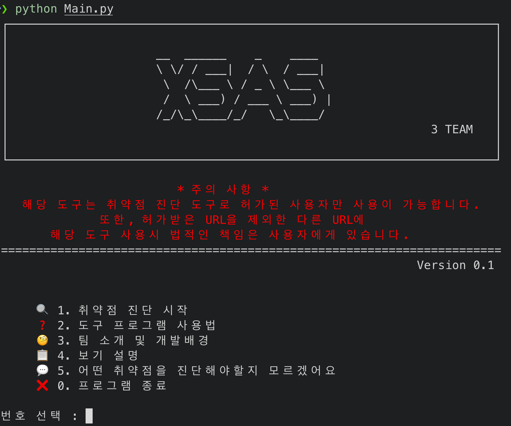

# XSS, SQLi 취약점 진단 도구 개발 및 테스트 페이지 구축

- XSAS는 XSS, SQL Injection 취약점을 탐지하기 위한 자동화 진단 도구입니다.
- 테스트 페이지 구축 Github (Apache-Tomcat, JSP, MariaDB) : <https://github.com/yeo0n/JSP-Tomcat-Board>

<br>

## 💻 프로젝트 개요

- OWASP Top 10 
  - XSS, SQLi는 웹에서 가장 많이 발견되는 취약점이며 OWASP Top 10 취약점으로 항상 선정
- 기존 진단 도구의 불편함 개선
  - 필요한 기능만 사용자에게 입력 받아 빠르게 진단 수행 가능
- 테스트 페이지 구축 효과
  - 직접 취약한 환경 구성을 통한 취약점 이해도 증진 및 안전한 테스트 수행 가능

<br>

### 👥 멤버 구성

- 박연준 (팀장) - 테스트 페이지 구축, 취약점 진단 도구 개발, PPT 제작, 발표
- 전태현 (팀원) - 취약점 진단 도구 개발, PPT 제작, 문서화
- 김우현 (팀원) - 취약점 진단 도구 개발, 문서화 

<br>

### 📌 주요 기능

- Reflected XSS
- Stored XSS
- DOM XSS
- Normal SQL Injection 
- Blind SQL Injection
- 세션 유지 크롤링 (인증 필요 페이지 접근 가능)
- 쿠키 및 User-Agent 헤더 수정 

<br>

### ⚙️ 실행 방법

```python
git clone https://github.com/yeo0n/XSS-SQL-Auto-Scanner.git
cd XSS-SQL-Auto-Scanner
pip3 install -r requirements.txt
python3 Main.py
```

<br>

### 🔍 결과


